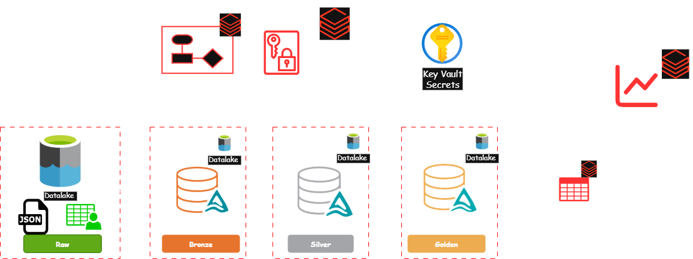
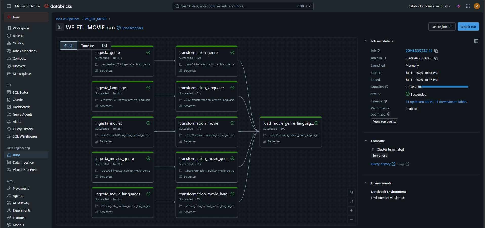
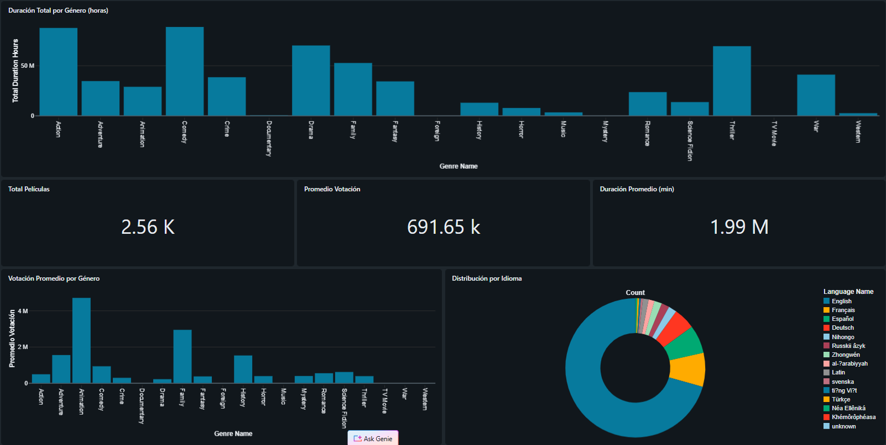

# Proyecto Final SmartData — ETL Movies en Databricks

Pipeline de datos para el procesamiento y análisis de información de películas, géneros e idiomas, construido sobre una arquitectura Medallion (Bronze → Silver → Gold) en Azure Databricks, con despliegue continuo entre ambientes.

<p align="left">
  
  
  
  
  
</p>

---

## Resumen del Proyecto

Este proyecto transforma archivos crudos de películas (`movie`, `genre`, `language`, `movie_genre`, `movie_languages`) en tablas de negocio listas para análisis. El flujo inicia con la carga manual de archivos a Azure Data Lake Storage Gen2, continúa a través de una arquitectura Medallion en Azure Databricks orquestada mediante un workflow multi-tarea, y concluye con dashboards SQL nativos de Databricks sobre la capa Gold.

---

## Características Principales

| Característica | Descripción |
|---|---|
| ETL Orquestado | Workflow multi-tarea con dependencias entre extracción, transformación y carga. |
| Arquitectura Medallion | Capas Bronze (extract) → Silver (transform) → Gold (load). |
| CI/CD | Despliegue automático de notebooks entre ambientes (Dev → Prod) con GitHub Actions. |
| Seguridad | Gestión de secretos mediante Azure Key Vault y Secret Scopes de Databricks. |
| Analítica | Dashboards SQL nativos de Databricks conectados a la capa Gold. |
| Delta Lake | Transacciones ACID y control de acceso (grants) sobre la capa medallion. |

---

## Arquitectura del Sistema



---
## Estructura del Repositorio

```
smartdata_proyectofinal_movies/
├── .github/
│   └── workflows/
│       └── deploy-notebook.yml            # CI/CD: exporta notebooks de origen e importa/despliega a destino
├── PrepAmb/
│   └── 00-ambientacion                    # Script de respaldo para aprovisionamiento del ambiente
├── proceso/
│   ├── prepamb/
│   │   └── 00-ambientacion                # Configuración inicial del ambiente (dentro del pipeline)
│   ├── extract/
│   │   ├── 01-ingesta_archivo_movie
│   │   ├── 02-ingesta_archivo_language
│   │   ├── 03-ingesta_archivo_genre
│   │   ├── 04-ingesta_archivo_movie_genre
│   │   └── 05-ingesta_archivo_movie_languages
│   ├── transform/
│   │   ├── 06-transformacion_archivo_movie
│   │   ├── 07-transformacion_archivo_language
│   │   ├── 08-transformacion_archivo_genre
│   │   ├── 09-transformacion_archivo_movie_genre
│   │   └── 10-ingesta_archivo_movie_languages
│   ├── load/
│   │   └── 11-results_movie_genre_language    # Capa de consumo: tabla final para dashboards
│   └── grants/
│       └── 12-grants-medallion                # RBAC: control de accesos sobre objetos de datos
├── reversion/
│   └── reverso                            # Script de reversión: limpieza y eliminación (drop/purge)
├── seguridad/
│   └── 12-grants-medallion                # Gobierno de datos: permisos y control de acceso
└── utilerias/
    ├── configurationes                    # Configuraciones y parámetros compartidos
    └── funciones_comunes                  # Funciones reutilizables por los notebooks del pipeline
```
---
## Estructura del Data Lake (ADLS Gen2)

El Data Lake (`azmedallonlakehouse`) está organizado en cuatro contenedores, uno por capa de la arquitectura medallion:

```
azmedallonlakehouse/
├── raw/            # Archivos fuente particionados por fecha de carga
│   └── 2024-12-16/
│       ├── movie.csv
│       ├── genre.csv
│       ├── language.csv
│       ├── movie_genre.json
│       └── movie_language/
├── bronze/         # Delta Tables: datos crudos ingeridos sin transformar
├── silver/         # Delta Tables: datos limpios, tipados y modelados
└── golden/         # Delta Tables: capa de consumo para dashboards
```

**Particionamiento por fecha:** el contenedor `raw` organiza los archivos en carpetas con formato `YYYY-MM-DD` (por ejemplo, `2024-12-16`), lo que permite manejar cargas incrementales: cada ejecución del pipeline procesa únicamente la carpeta de fecha correspondiente al parámetro `param_file_date`.

---
## Ciclo de Vida del Dato

1. **Ingesta (Bronze):** carga manual de archivos fuente al contenedor `raw` de ADLS Gen2 (particionado por fecha), seguida de la ingesta hacia Delta Tables en el contenedor `bronze`.
2. **Transformación (Silver):** limpieza, tipado y normalización de `movie`, `language`, `genre`, `movie_genre` y `movie_languages`, persistidas como Delta Tables en `silver`.
3. **Carga (Gold):** consolidación en la tabla de resultados `results_movie_genre_language` sobre el contenedor `golden`, optimizada para consumo analítico.
4. **Gobierno:** aplicación de grants y permisos sobre los objetos de la capa medallion.
5. **Exposición:** consulta de la capa Gold mediante dashboards SQL nativos de Databricks.

---
## Pre-requisitos y Configuración

**Cluster.** El pipeline utiliza un cluster existente (`cluster_SD`) referenciado por nombre en el workflow para optimizar costos.

**Seguridad (Azure Key Vault).** Configura un Secret Scope en Databricks vinculado a Azure Key Vault para el manejo seguro de credenciales y tokens utilizados por el pipeline.

**CI/CD Setup (GitHub Secrets).** Para habilitar el despliegue automático entre ambientes, configura los siguientes secretos en el repositorio:

| Secreto | Descripción |
|---|---|
| `DATABRICKS_ORIGIN_HOST` | URL del workspace de origen (Dev). |
| `DATABRICKS_ORIGIN_TOKEN` | Token de acceso del workspace de origen. |
| `DATABRICKS_DEST_HOST` | URL del workspace de destino (Prod). |
| `DATABRICKS_DEST_TOKEN` | Token de acceso del workspace de destino. |

---
## Despliegue y Orquestación

### Pipeline de CI/CD (`deploy-notebook.yml`)

El workflow de GitHub Actions realiza, en cada push a `main`:

1. **Exportación:** descarga en modo `JUPYTER` (raw) todos los notebooks del proyecto desde el workspace de origen, incluyendo `proceso/` y `utilerias/`.
2. **Despliegue:** recrea la estructura de carpetas en el workspace destino e importa cada notebook preservando su ruta relativa.
3. **Gestión del workflow:** verifica si `WF_ETL_MOVIE` ya existe en destino; si es así, lo elimina antes de recrearlo.
4. **Creación del job:** genera el workflow `WF_ETL_MOVIE` con sus tareas y dependencias sobre el cluster existente.
5. **Ejecución y monitoreo:** dispara la ejecución del job y monitorea su estado hasta finalizar o alcanzar el timeout.

---
### Workflow Databricks (`WF_ETL_MOVIE`)



**Tareas y dependencias:**

| Tarea | Depende de |
|---|---|
| `Ingesta_genre` | — |
| `Ingesta_language` | — |
| `Ingesta_movie_languages` | — |
| `Ingesta_movies` | — |
| `ingesta_movies_genre` | — |
| `transformacion_genre` | `Ingesta_genre` |
| `transformacion_language` | `Ingesta_language` |
| `transformacion_movie` | `Ingesta_movies` |
| `transformacion_movie_genres` | `ingesta_movies_genre` |
| `transformacion_movie_languages` | `Ingesta_movie_languages` |
| `load_movie_genre_lenguages` | Todas las tareas de transformación |

**Timeout del job:** 7200 segundos · **Concurrencia:** máximo 1 ejecución simultánea.

---
## Visualización y Entrega de Datos

El cierre del pipeline se realiza mediante dashboards SQL nativos de Databricks (Lakeview), consultando directamente la tabla de la capa Gold (`results_movie_genre_language`), sin necesidad de herramientas de BI externas como Power BI.

### Dashboard: Películas y Géneros

El dashboard incluye filtros globales por **Género** e **Idioma**, junto con las siguientes visualizaciones:

| Visualización | Descripción |
|---|---|
| Duración Total por Género (horas) | Suma de duración de películas agrupada por género. |
| Total Películas · Promedio Votación · Duración Promedio | KPIs generales del catálogo. |
| Votación Promedio por Género | Comparación de votación promedio entre géneros. |
| Distribución por Idioma | Proporción de películas por idioma original. |
| Películas por Año de Estreno | Tendencia de estrenos a lo largo del tiempo. |




---
## Seguridad

- Los tokens y credenciales sensibles se gestionan mediante Azure Key Vault, vinculado a un Secret Scope de Databricks.
- Las credenciales de despliegue (hosts y tokens de origen/destino) se almacenan como GitHub Secrets y nunca se exponen en el código del pipeline.
- El control de acceso a los datos de la capa medallion se gestiona mediante la tarea `grants-medallion`.

---

## 👤 Autor

<div align="center">

### **Giovanny Montero**
*Data Engineer · NET Senior Developer*

[](https://www.linkedin.com/in/giovannymontero)

</div>